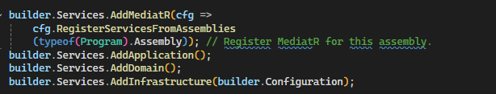
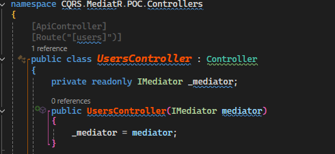
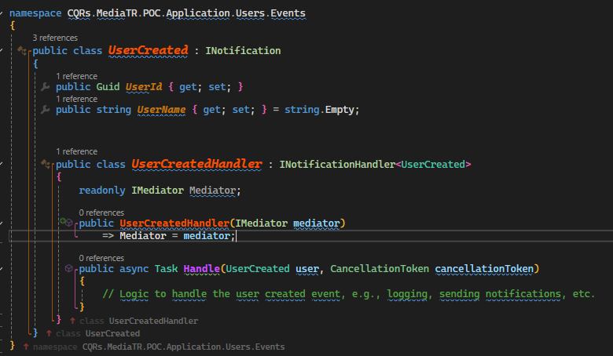
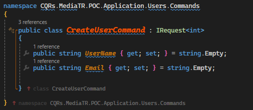
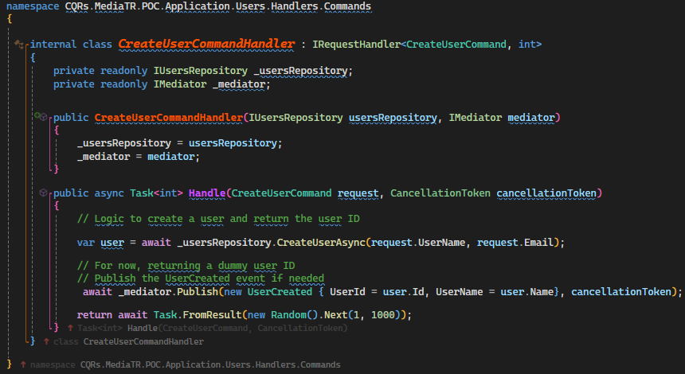

# MediaTR-CQRs-Config-POC

Initial setup for MediatR with CQRS and event-driven pattern.

# MediaTR Basics

MediatR is a library for implementing the Mediator pattern in .NET apps. It provides a way to handle communication between different modules of the application by encapsulating the logic of sending and handling messages.

## Configuration

MediatR needs to be correctly configured in order to avoid problems. In the example, MediatR is being registered in the services. After that, it needs to be injected as a dependency where it should be used.

### Registers

### Injection

# The IMediator interface is split in two interfaces: IPublisher and ISender

## Publish

MediatR's publish is from IPublisher's interface, and is used for events that doesn't need a response, also named one-to-many communication. It serves well for managing states of other modules of the application and controlling the application's behavior. An example in this project is the UserCreated Notification. After user's creation on DB, it publishes an event(Notification) about its creation and can carry user's data for any operations that can be performed with it in order to improve the user's experience or the apps further actions.

### Implementation example

## Send

MediatR's send method is from ISender's interface, and is the opposite of the Publish method. Instead of just throwing an event(Query or Command), it also should awaits for a response from the other application layers. Sender is made to mediate Queries (Data Output) and Commands (Data Inputs), passing object parameters for repositories. In an one-to-one communication way, providing CQRs (Command Query Responsibility Segregation) in the system.

### Implementation example

#### Command

#### Handler

